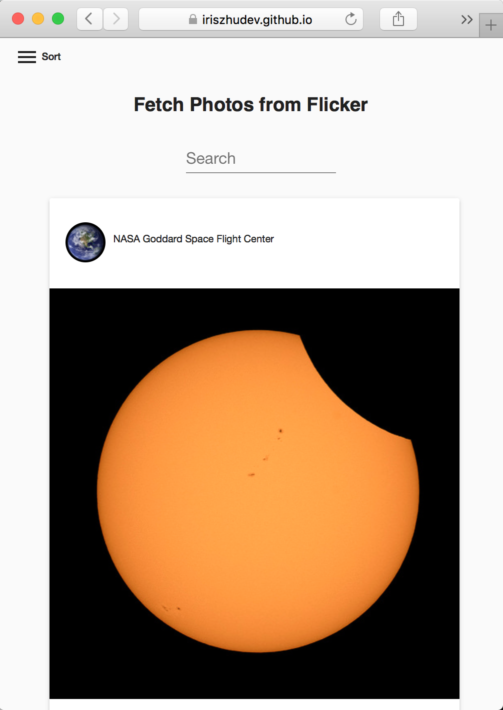
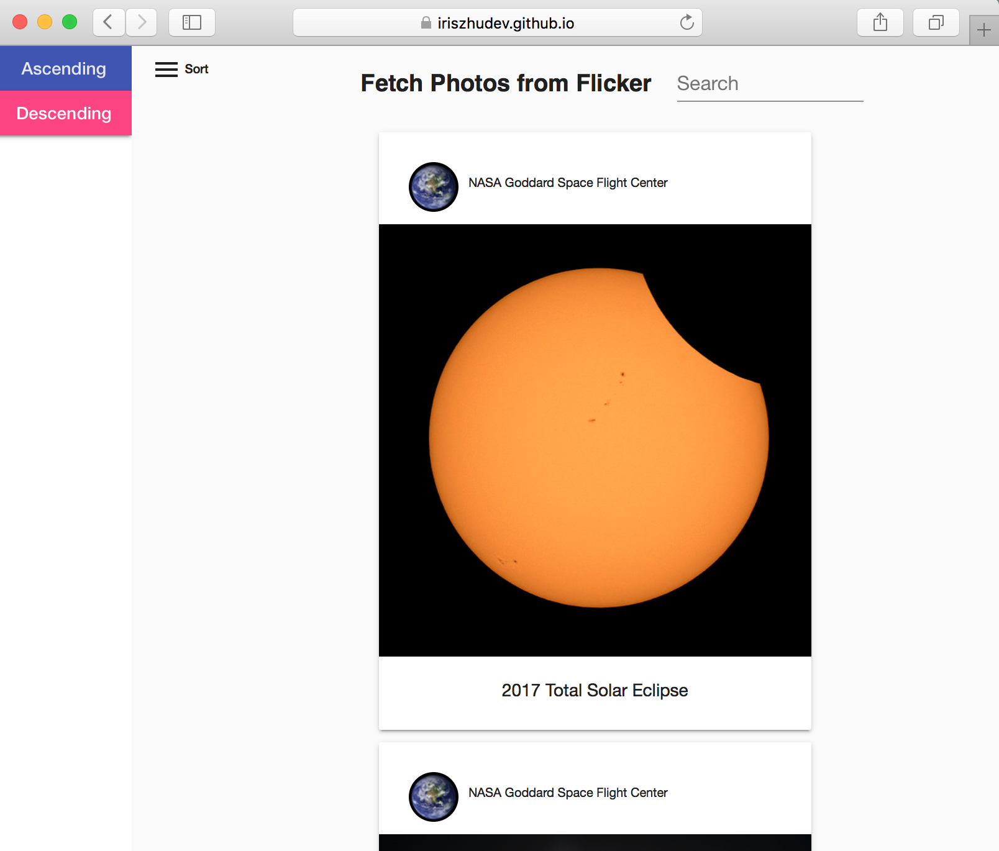

# Fetch photos with Flicker API

This project used Angular and Flicker API to fetch images from Nasa's account.

## Live Demo

https://iriszhudev.github.io/flicker-task/

## UI and responsive design

This project used UI components from angular-material.

Layout for small screen :

Layout for medium to large screen(>600px):

Sidebar visibility can be toggled by clicking the menu button.

## Browser and device compatibility 

This application has been tested with all the features successfully running on:
Safari 9,
Chrome 63, 
Firefox Developer Edition 58,
Opera 49,
Microsoft Edge 38,
Internet Explorer 11,
Iphone 5 (iOS Safari & Chrome)

## API in use

This project used flickr.people.getInfo and flickr.people.getPublicPhotos to get photos and user profile from Nasa's account.

## Sorting and filtering

### Sort
Photos from Flicker API are sorted by title in ascending order by default.
Click on the menu button to toggle the sidebar. Click on ascending or descending button to change sorting order of photos.

### Search
Photos will be filtered by the input string from the search bar(search in titles).

## Development server

After installing angular-cli and all the dev dependencies via npm, run `ng serve` for a dev server. Navigate to `http://localhost:4200/`. The app will automatically reload if you change any of the source files.

